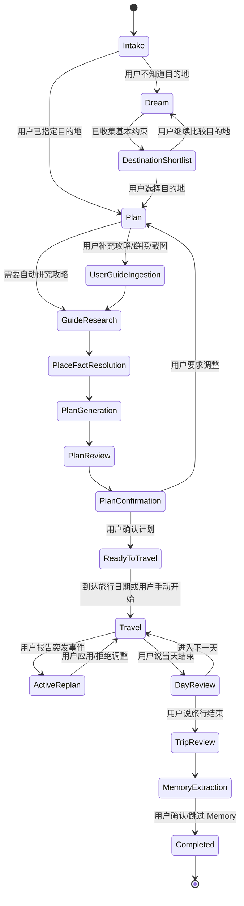

# Byway / 另辟蹊径 — Agent 状态机文档

---

## 1. 文档目标

Byway 是一个全 Agent 产品，但它不能变成没有结构的聊天机器人。后端必须维护明确的旅行状态和 Agent 模式。

本文定义：

- Agent 运行状态。
- 状态转换条件。
- 每个状态允许使用的能力。
- 每个状态对应的 Artifact。
- 典型用户输入如何路由。

---

## 2. 顶层状态图



---

## 3. 状态定义

## 3.1 Intake

### 目的

理解用户当前想做什么。

### 典型输入

```text
帮我推荐国庆去哪玩
我想去青岛 4 天
这是我去西安的攻略，帮我规划
老人累了，我们晚了 40 分钟
今天结束了，帮我总结
```

### Agent 动作

- 调用 `classify_intent` 内部逻辑或由 Hermes 自行判断。
- 若没有 Trip，调用 `create_trip` 或进入临时会话。
- 若用户不知道目的地，进入 Dream。
- 若用户指定目的地，进入 Plan。
- 若当前 Trip 正在旅行中，进入 Travel。

### 不允许

- 不直接生成完整计划。
- 不跳过状态进入最终结论。

---

## 3.2 Dream

### 目的

用户不知道去哪时，收集推荐目的地所需约束。

### 关键字段

- 出发地。
- 时间 / 月份 / 假期。
- 天数。
- 同行人。
- 国内/海外倾向。
- 预算压力。
- 节奏偏好。
- 主题偏好。
- Family Memory。

### Agent 动作

- 调用 `update_trip_brief`。
- 调用 `get_accepted_family_memory`。
- 如关键字段缺失，最多追问 3 个问题。
- 如果信息足够，进入 DestinationShortlist。

### Artifact

- `TripBriefArtifact`
- `MissingInfoArtifact`

### 示例回复

```text
我先按“北京出发、4 天含往返、6 人全家、轻松节奏”来推荐。
目前还差两个信息：你更想海边/历史文化/美食，还是无所谓？预算大概中等还是偏高？
```

---

## 3.3 DestinationShortlist

### 目的

生成并比较 3-5 个候选目的地。

### Agent 动作

调用：

- `generate_destination_candidates`
- `research_destination_candidate`
- `score_destination_candidates`

输出候选卡片。

### Artifact

`DestinationShortlistArtifact`

字段包括：

- 目的地。
- 推荐指数。
- 适合组合。
- 推荐天数。
- 交通适配。
- 家庭适配。
- 主要风险。
- 为什么推荐。
- 为什么不推荐。

### 转换

- 用户选择某目的地：调用 `select_destination`，进入 Plan。
- 用户要求更多候选：停留在 DestinationShortlist。
- 用户改变约束：回到 Dream。

---

## 3.4 Plan

### 目的

针对已知目的地生成旅行计划。

### 关键字段

- 目的地。
- 出发地。
- 天数。
- 同行人。
- 抵达/离开时间。
- 是否已定酒店。
- 是否已有攻略。
- 节奏偏好。

### Agent 动作

- 更新 TripBrief。
- 判断是否需要攻略研究。
- 如果用户提供攻略，进入 UserGuideIngestion。
- 如果没有攻略，进入 GuideResearch。

### Artifact

- `TripBriefArtifact`
- `PlanningAssumptionsArtifact`

---

## 3.5 UserGuideIngestion

### 目的

吸收用户补充的攻略资料。

### 支持输入

- markdown。
- 普通文本。
- 小红书链接。
- 截图。
- 网页链接。
- 用户手动备注。

### Agent 动作

调用：

- `ingest_user_guide_source`
- 必要时调用 OCR / 图片理解工具。
- 吸收后进入 GuideResearch 或 GuideMerge。

### 注意

小红书链接不能承诺完整抓取。若无法读取，保存链接和用户备注即可。

---

## 3.6 GuideResearch

### 目的

自动研究目的地攻略，形成结构化攻略底稿。

### Agent 动作

调用：

- `generate_synthetic_guides`
- `merge_guides`

Synthetic Guide 视角至少包括：

- 经典首次游。
- 老人孩子友好。
- 住宿区域。
- 用餐区域。
- 避坑与风险。
- 雨天/疲劳备选。

### Artifact

`GuideSummaryArtifact`

---

## 3.7 PlaceFactResolution

### 目的

对计划候选中的关键地点进行事实定位。

### Agent 动作

调用：

- `resolve_places_batch`
- `get_place_detail`
- `estimate_route_matrix`

### 规则

- 4/5 星核心地点必须解析 PlaceFact。
- 低置信度必须提示用户。
- 不得让 LLM 编造坐标、营业时间、电话、评分。

### Artifact

`PlaceFactReviewArtifact`

---

## 3.8 PlanGeneration

### 目的

生成 Day-by-day 旅行计划。

### Agent 动作

调用：

- `generate_plan`
- `verify_plan_geo`

### 计划必须包括

- 每天主要路线。
- 住宿区域建议。
- 用餐区域建议。
- 核心景点和可选景点。
- 每天风险点。
- 缺失信息和假设。

### Artifact

`PlanArtifact`

---

## 3.9 PlanReview

### 目的

审核计划是否可执行。

### Agent 动作

调用：

- `verify_plan_geo`
- 必要时调用 `estimate_route_matrix`

检查：

- 是否绕路。
- 餐点是否合理。
- 老人孩子是否过载。
- 抵达/离开日是否安排过重。
- 是否存在低置信度核心地点。

---

## 3.10 PlanConfirmation

### 目的

让用户确认计划，或继续调整。

### Agent 动作

- 总结计划。
- 列出关键假设和需要确认的点。
- 提供操作：确认计划 / 继续调整。

### 转换

- 用户确认：调用 `confirm_plan`，进入 ReadyToTravel。
- 用户调整：进入 Plan。

---

## 3.11 ReadyToTravel

### 目的

计划已确认，等待旅行开始。

### Agent 动作

- 保持计划。
- 用户可随时补充酒店/餐厅/交通信息，触发局部更新。
- 用户可手动进入 Travel。

---

## 3.12 Travel

### 目的

旅行中执行当天计划。

### Agent 动作

调用：

- `get_today_status`
- 必要时更新 current / next 节点。

### Artifact

`TodayArtifact`

字段：

- 今天第几天。
- 当前节点。
- 下一个节点。
- 后续节点。
- 酒店/用餐 anchor。
- 今日已发生事件。

### 典型输入

```text
我们晚了 40 分钟
老人累了
孩子不想坐车
现在大家饿了
突然下雨了
想回酒店
```

这些输入进入 ActiveReplan。

---

## 3.13 ActiveReplan

### 目的

处理突发事件，给出调整方案。

### Agent 动作

调用：

- `record_travel_event`
- `replan_today`

必须输出：

- 取消方案。
- 顺延方案。
- 重排方案。
- 推荐方案。
- 影响范围。
- 是否需要确认。

用户确认后调用 `apply_replan`。

### 不允许

- 不允许直接修改计划而不展示 diff。
- 不允许只用自然语言建议、不生成结构化选项。

---

## 3.14 DayReview

### 目的

每天结束后生成日志。

### Agent 动作

调用：

- `generate_day_log`

### Artifact

`DayLogArtifact`

内容：

- 原计划。
- 实际完成。
- 取消 / 顺延 / 重排。
- 突发事件。
- 当日体验总结。
- 可能的 Memory 线索。

---

## 3.15 TripReview

### 目的

旅行整体结束后生成总结。

### Agent 动作

调用：

- `generate_trip_log`

### Artifact

`TripLogArtifact`

---

## 3.16 MemoryExtraction

### 目的

提取家庭旅行 Memory 候选。

### Agent 动作

调用：

- `extract_family_memory_candidates`

用户确认后调用：

- `accept_family_memory`

### 规则

Memory 必须经过用户确认才进入长期有效记忆。

---

## 4. 意图路由规则

| 用户输入 | 状态 | 处理 |
|---|---|---|
| “不知道去哪” | Dream | 推荐目的地 |
| “帮我规划青岛 4 天” | Plan | 自动攻略研究 + 计划 |
| “这是攻略” | UserGuideIngestion | 吸收资料 |
| “第一天下午到” | Plan / Ready | 更新 TripBrief，必要时重排 |
| “老人累了” | Travel / ActiveReplan | 记录事件并重排 |
| “今天结束了” | DayReview | 生成日志 |
| “旅行结束了” | TripReview | 生成总结与 Memory |

---

## 5. 状态持久化要求

每次状态转换都必须落库：

```text
trip.phase
trip.updatedAt
artifact snapshots
agent messages
pending confirmations
```

不要只依赖 Hermes 上下文。

---

## 6. Pending Confirmation

以下情况必须创建 `PendingConfirmation`：

- 用户选择目的地。
- 确认计划。
- 应用重排方案。
- 接受 Family Memory。
- 替换核心住宿区域。
- 取消 4/5 星景点。
- 调整明天计划。

用户确认后，工具才执行状态变更。

---

## 7. 状态机验收标准

- 任意时刻 `get_trip_state` 能返回当前 phase 和关键 artifact。
- 用户刷新网页后可以恢复当前旅行状态。
- 旅行中事件不会丢失。
- 未确认的重排不会改写权威计划。
- 完成旅行后能看到 TripLog 和 Memory 候选。
