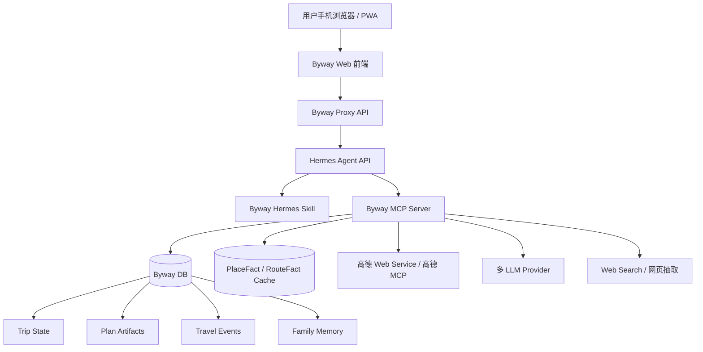
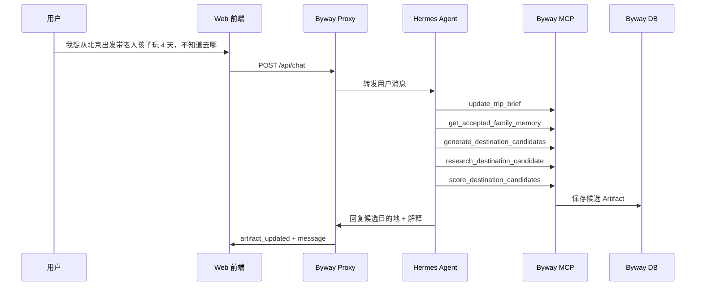
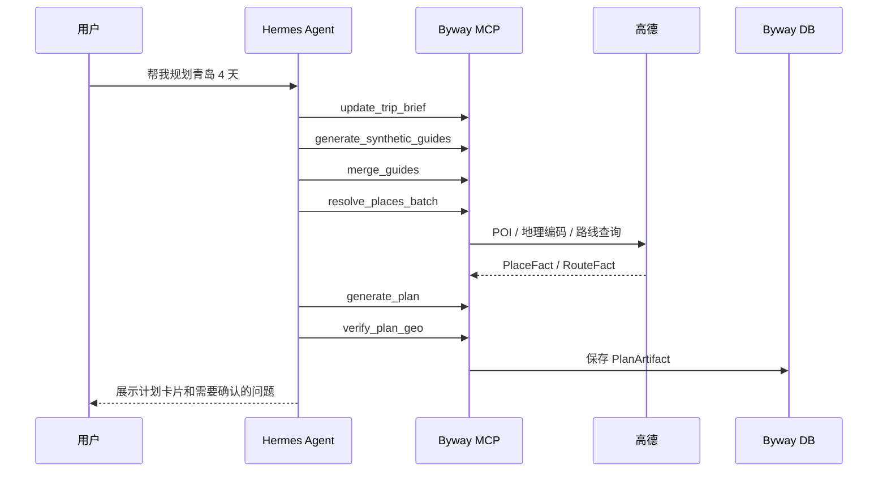
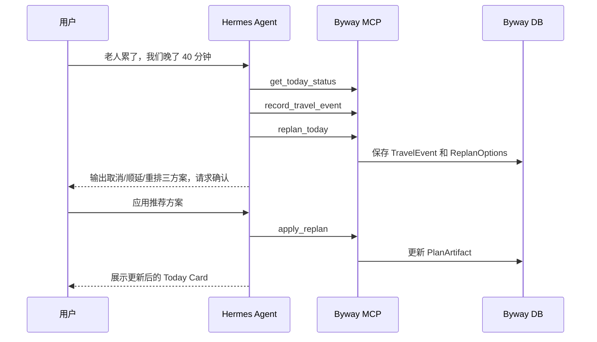
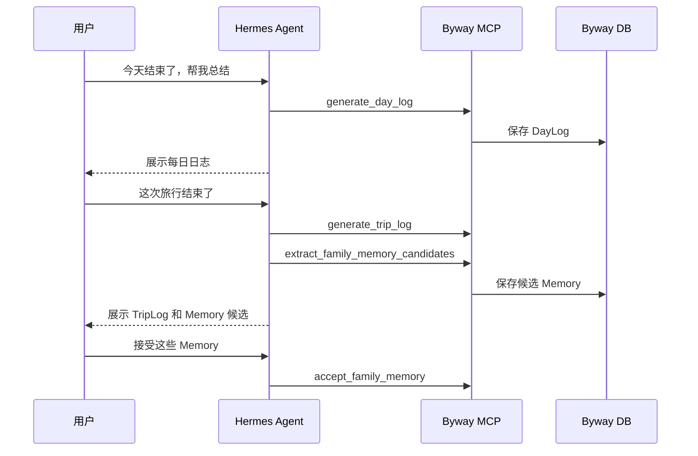

# Byway / 另辟蹊径 — 系统架构文档

---

## 1. 架构目标

Byway 的架构目标是：

```text
轻前端 + 强 Agent + 可控工具层 + 结构化状态 + 地图事实校验
```

它不是传统 App 架构，也不是纯 Chatbot 架构。

---

## 2. 总体架构图



---

## 3. 分层职责

### 3.1 Mobile Web / PWA

**职责：**

- 展示聊天对话。
- 展示旅行 Artifact。
- 接收用户输入、截图、链接、markdown。
- 发送确认动作。

**不做：**

- 不做 Agent 推理。
- 不做高德调用。
- 不保存权威状态。
- 不做复杂规划算法。

---

### 3.2 Byway Proxy API

**职责：**

- 前端唯一后端入口。
- 隐藏 Hermes API Key。
- 做鉴权、限流、会话绑定。
- 将 Hermes 的回复和工具事件转成前端流式事件。
- 提供 Artifact 查询和用户确认 API。

**为什么需要 Proxy：**

Hermes Agent 后台能力强，可能拥有工具、文件、网络、终端等能力。不要把 Hermes API 直接暴露到公网前端。

---

### 3.3 Hermes Agent API

**职责：**

- Agent 对话运行时。
- 基于 Byway Skill 理解用户意图。
- 在 Dream / Plan / Travel / Review 之间切换。
- 调用 Byway MCP 工具。
- 向用户解释工具结果。

**不做：**

- 不作为权威业务数据库。
- 不直接存储计划版本。
- 不编造地点事实。

---

### 3.4 Byway Hermes Skill

**职责：**

- 定义 Byway Agent 的身份。
- 定义模式和工作流。
- 定义工具调用规则。
- 定义事实边界和确认规则。

Skill 是 Agent 的行为说明书。

---

### 3.5 Byway MCP Server

**职责：**

- 所有确定性业务能力的入口。
- 读写 Trip、Plan、PlaceFact、TravelEvent、Memory。
- 调用外部服务。
- 做 schema 校验。
- 输出结构化 Artifact。

MCP Server 是 Byway 的手脚和记账本。

---

### 3.6 Byway DB

**职责：**

保存权威状态：

- 用户和家庭成员。
- 旅行摘要。
- 攻略来源。
- Canonical Guide。
- PlaceFact / RouteFact。
- PlanArtifact。
- TravelEvent。
- DayLog / TripLog。
- FamilyMemory。
- AgentMessage 与 ArtifactSnapshot。

---

### 3.7 高德 / PlaceFact Layer

**职责：**

- 标准地点名称。
- 高德 POI ID。
- 经纬度。
- 地址。
- 入口坐标。
- 打车地址。
- 电话。
- 营业时间。
- 评分。
- 路线耗时。
- 导航 URI。

高德是 Byway 的“眼睛和地图”。Hermes 不得替代它编造地点事实。

---

## 4. 核心数据流

### 4.1 Dream Mode：不知道去哪



---

### 4.2 Plan Mode：已知目的地



---

### 4.3 Travel Mode：旅行中突发事件



---

### 4.4 Review Mode：日志与 Memory



---

## 5. 部署形态

### 5.1 个人内网 / 自用部署

```text
手机 PWA
↓
局域网 / Tailscale
↓
Byway Proxy + Hermes + MCP + DB
```

适合早期自用。

---

### 5.2 公网部署

```text
手机 PWA
↓ HTTPS
Byway Proxy API
↓ 内网
Hermes Agent API
↓ MCP
Byway MCP Server
↓
DB / 高德 / LLM
```

公网部署时必须：

- 不暴露 Hermes API Key。
- Hermes 尽量只监听内网或 localhost。
- Proxy 做鉴权与限流。
- 前端只能访问 Proxy。

---

## 6. 关键架构原则

1. **Agent 可思考，但工具负责事实与状态。**
2. **聊天是入口，Artifact 是结果。**
3. **PlaceFact 是计划可靠性的基础。**
4. **所有旅行中事件必须落库。**
5. **所有关键变更必须产生可确认的 diff。**
6. **Memory 必须用户确认后才进入长期记忆。**

---

## 7. 架构反模式

避免：

```text
Web 前端 -> LLM -> 纯文本计划
```

避免：

```text
Hermes 自己在聊天上下文里维护所有计划，不落库
```

避免：

```text
用户手动管理所有地点和节点
```

避免：

```text
LLM 编造坐标、电话、营业时间、路线耗时
```

正确架构是：

```text
用户自然语言
↓
Hermes Agent 理解
↓
Byway MCP 工具执行
↓
结构化状态 / 地图事实
↓
Artifact 展示
```
