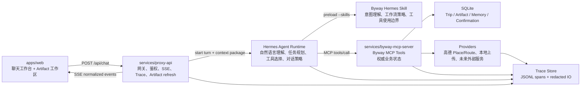

# Phase 4.0 最终 Agent 架构设计

> 状态更新：本文是 Hermes-first 版本的 Phase 4.0 设计，现保留为决策历史。后续实施以 Hybrid 版本为准：`docs/superpowers/specs/2026-05-24-phase-4-hybrid-agent-runtime-design.md`。

## 背景

Byway 的产品目标是一个真正的旅行 Agent，而不是一套规则工作流。用户确定旅行计划之后，系统应该天然拥有 trip 上下文、家庭偏好、当前计划、地点事实、路线事实和待确认项。用户可以继续用自然语言表达：

- 第三天可以改成灵隐寺吗？
- 第四天从西湖边散步改成大运河。
- 今天老人累了，取消一个可选景点。
- 下午加一点室内活动，别太累。
- 这家餐厅不想去了，帮我换个附近轻松一点的。

当前 `/api/chat` 仍有大量规则逻辑：正则识别模式、关键词抽取目的地、硬编码核心地点、用模板生成计划。它能跑通 mock 验收，但会让产品交互僵硬，也会导致“用户选杭州却生成青岛计划”这类上下文错配。

Phase 4.0 不再做过渡版。目标是直接按最终架构规划：Hermes 作为 Agent 编排层和 MCP client，Byway Hermes Skill 作为领域操作手册，Byway MCP 作为确定性业务工具层，Proxy API 作为网关、鉴权、SSE、Trace 和安全边界。

## 总目标

1. `/api/chat` 主链路切到 Hermes Agent Runtime。
2. Hermes 每次 Byway turn 必须加载 `byway-family-travel-agent` Skill。
3. Hermes 直接作为 MCP client 调用 Byway MCP 工具，不再由 Proxy 用规则生成 `AgentTurnPlan`。
4. Proxy 只负责请求入口、会话鉴权、上下文包构造、SSE 事件归一化、Artifact 刷新、错误收敛和 Trace。
5. Byway MCP 继续作为权威工具层，负责 Trip、TripBrief、Artifact、PlaceFact、RouteFact、TravelEvent、PendingConfirmation 和 FamilyMemory 的读写。
6. Mock runtime 只用于测试、离线演示和显式 fallback，不能在生产配置中静默替代 Hermes。
7. 生产可用性必须内建可观测性：每次 chat turn 有 traceId，每次 Agent 调用、MCP 工具调用、Provider 调用都有 span 和结构化日志。

## 最终架构



## 分层职责

### 前端 Web

前端负责：

- 发送用户消息、附件和 clientContext。
- 展示聊天、工具进度、确认条、Artifact 工作区。
- 展示当前 traceId 和调试入口，方便验收时查看本轮输入输出。
- 根据 SSE 更新 UI 状态。

前端不负责：

- 猜测用户意图。
- 自己拼 MCP 工具参数。
- 持有高德、Hermes 或其他服务密钥。

### Proxy API

Proxy 负责：

- 本地家庭 PIN/session 鉴权。
- 创建或恢复 tripId。
- 为每次 `/api/chat` 创建 `traceId`、`turnId`、`requestId`。
- 构造紧凑的 Agent Context Package，包含当前 trip state、最近 artifacts、pending confirmations、accepted memory、可用工具目录和安全边界。
- 调用 Hermes Agent Runtime。
- 把 Hermes 事件归一化成前端 SSE。
- 在 Hermes turn 结束后通过 Byway MCP 只读刷新 trip state，并向前端发送 artifact 更新。
- 提供 `/api/traces` 和 `/api/traces/:traceId` 供验收与排障。
- 对所有日志和 trace 做敏感信息脱敏。

Proxy 不负责：

- 用 regex 判断 Dream / Plan / Travel / Review。
- 用关键词推断用户计划修改。
- 直接执行计划生成、地点解析、重排等业务工具序列。
- 静默把生产环境降级到 mock agent。

### Hermes Agent Runtime

Hermes 负责：

- 理解自然语言。
- 根据上下文判断用户处于 Dream、Plan、Plan edit、Travel、Review、Place QA 或 Clarify。
- 选择并调用 Byway MCP tools。
- 将工具结果纳入下一步推理。
- 输出自然语言解释、澄清问题和确认前说明。
- 遵守 Byway Hermes Skill 中的意图分类、工具编排、事实边界、确认边界和回复风格。

Hermes 不负责：

- 绕过 Byway MCP 写数据库。
- 伪造 PlaceFact、RouteFact、营业时间、电话、经纬度或路线耗时。
- 直接执行付款、预订、下单。
- 抓取无授权平台内容。

### Byway Hermes Skill

`skills/byway-family-travel-agent/SKILL.md` 是 Hermes 在 Byway 产品中的领域操作手册。它不是 MCP 工具，也不是 prompt 片段，而是 Hermes 每次处理 Byway chat turn 时必须加载的 Skill。

详细设计策略见 [Byway Hermes Skill 设计策略](2026-05-24-byway-hermes-skill-strategy-design.md)。后续实现 Skill 时，以该文档中的“七层设计”和“反模式”为主要判断依据，避免把 Proxy 里的规则分支原样搬进 Skill。

Skill 负责：

- 定义 Byway Agent 身份、回复风格和家庭旅行优先级。
- 定义 Dream / Plan / Plan Edit / Place QA / Travel / Review / Memory 的意图识别规则。
- 定义每类意图应该优先调用哪些 Byway MCP tools。
- 定义工具调用前后的思考顺序，例如先读 `get_trip_state`，再决定是否更新 TripBrief 或 PlanArtifact。
- 定义事实边界：地点、地址、经纬度、电话、营业时间、路线耗时必须来自 PlaceFact / RouteFact。
- 定义确认边界：`confirm_plan`、`apply_replan`、`accept_family_memory` 等高影响动作必须经用户确认。
- 定义缺失信息处理方式：不阻塞时先假设并说明，关键缺失信息最多一次问 3 个。
- 定义旅行中重排策略：疲劳、饥饿、下雨、晚点、交通变更、偏好变化的处理优先级。

Skill 不负责：

- 持久化状态。
- 替代 Byway MCP tool contract。
- 包含 API key、session token、用户隐私原文或生产配置。
- 引用尚未在 `BYWAY_MCP_TOOLS` 中注册的工具名。

Skill 必须工程化管理：

- 仓库内源文件是 `skills/byway-family-travel-agent/SKILL.md`。
- Hermes 加载副本位于 `~/.hermes/skills/travel/byway-family-travel-agent/SKILL.md`。
- Proxy 启动 Hermes 时必须显式传入 `--skills byway-family-travel-agent`。
- 每次 Agent turn 的 trace 必须记录 skill name、version、hash 和加载路径。
- CI/测试必须校验 Skill 中引用的工具名都存在于 Byway MCP tool catalog。
- Skill 版本变化应该进入 Trace，方便验收时判断某次错误是否由 Skill 行为说明导致。

### Byway MCP Server

Byway MCP 负责：

- 提供 `BYWAY_MCP_TOOLS` 中的工具契约。
- 执行 schema 校验和业务校验。
- 持久化 Trip、ArtifactSnapshot、PlaceFact、RouteFact、TravelEvent、PendingConfirmation、FamilyMemory。
- 调用真实高德或 mock provider。
- 对高影响动作创建或消费 PendingConfirmation。
- 在 MCP protocol 层记录每个工具调用的输入、输出、耗时、成功失败和 traceId。

Byway MCP 不负责：

- 自然语言理解。
- Agent 对话策略。
- 以模板猜测用户意图。

## 主链路

1. 用户在 Web 输入自然语言。
2. Web 调 `POST /api/chat`，携带 `tripId`、message、attachments、clientContext。
3. Proxy 完成鉴权，创建 `traceId`，记录 `chat.request.received` span。
4. Proxy 构造 Agent Context Package：
   - 用户原文和附件摘要。
   - 当前 trip phase 和 TripBrief。
   - 当前 PlanArtifact、TodayArtifact、ReplanOptionsArtifact、DayLog、TripLog、MemoryCandidate 的摘要。
   - PendingConfirmation。
   - Accepted FamilyMemory。
   - Byway MCP 工具目录。
   - 安全边界和确认规则。
5. Proxy 启动 Hermes Agent turn，并把 `traceId` 作为环境变量、prompt metadata 和 context 字段传入。
6. Hermes 加载 `byway-family-travel-agent` Skill，依据 Skill 和 Agent Context Package 判断意图与工具序列。
7. Hermes 作为 MCP client 调用 Byway MCP tools。
8. Byway MCP 在 tool call 入口记录 `mcp.tool.started`，完成后记录 `mcp.tool.completed` 或 `mcp.tool.failed`。
9. Hermes 输出 assistant message、tool event 或 final event。
10. Proxy 把 Hermes 事件映射成 SSE：
   - `trace_started`
   - `assistant_message_delta`
   - `tool_call_started`
   - `tool_call_completed`
   - `artifact_updated`
   - `confirmation_required`
   - `error`
11. Hermes turn 结束后，Proxy 调用 Byway MCP 的只读 `get_trip_state`，刷新前端 Artifact 工作区。
12. Web 显示 traceId，验收者可打开 trace 查看每一环节输入输出。

## Hermes 接入策略

Phase 4.0 的主运行模式是 `hermes_agent`：

```dotenv
BYWAY_AGENT_RUNTIME=hermes_agent
HERMES_COMMAND=hermes
HERMES_AGENT_ARGS=chat,--json-events
HERMES_AGENT_SKILLS=byway-family-travel-agent
HERMES_AGENT_TIMEOUT_MS=90000
```

核心要求：

- Hermes 运行时必须能访问已注册的 Byway MCP server。
- `hermes mcp list` 必须能看到 Byway MCP。
- Hermes Agent 必须加载 Byway Skill；仅在 prompt 中临时拼接规则不算生产可用。
- Hermes Agent prompt 只补充本轮上下文，稳定行为规则由 Byway Skill 承载。
- Hermes 事件流优先使用 JSONL 或结构化 event stream。
- 如果当前 Hermes CLI 只能返回最终文本，Proxy 仍必须通过 Byway MCP trace 和最终 artifact refresh 提供可验收链路，但生产 health 必须明确标记 `agentEventStream=false`。

现有 Hermes MCP messaging bridge 只保留为调试能力：

- `/api/hermes/mcp/probe`
- `/api/hermes/mcp/channels`
- `/api/hermes/mcp/conversations`
- `/api/hermes/mcp/messages`

它不是 Byway chat 的主编排层，不参与旅行工具调用决策。

## Agent Context Package

Context Package 必须紧凑、可审计、可脱敏。建议结构：

```ts
type AgentContextPackage = {
  trace: {
    traceId: string;
    turnId: string;
    requestId: string;
  };
  skill: {
    name: "byway-family-travel-agent";
    version: string;
    hash: string;
  };
  request: {
    userId: string;
    text: string;
    attachments: Array<{
      fileId?: string;
      filename?: string;
      mimeType?: string;
      textPreview?: string;
    }>;
    clientContext: Record<string, unknown>;
  };
  trip: {
    tripId?: string;
    phase?: string;
    brief?: Record<string, unknown>;
    currentPlanSummary?: Record<string, unknown>;
    currentTodaySummary?: Record<string, unknown>;
    pendingConfirmations: Record<string, unknown>[];
    recentArtifacts: Record<string, unknown>[];
  };
  memory: {
    acceptedFamilyMemory: Record<string, unknown>[];
  };
  tools: Array<{
    name: string;
    description: string;
    highImpact: boolean;
    confirmationRequired: boolean;
  }>;
  safety: {
    forbiddenIntents: string[];
    factBoundaries: string[];
    confirmationRules: string[];
  };
};
```

原则：

- 不把完整历史无限塞入 prompt。
- Artifact 只传当前决策需要的摘要和 ID。
- 原始上传内容只传摘要，完整内容由 Byway MCP ingestion 工具管理。
- 所有 context package 都写入 trace，但敏感字段脱敏。

## 可观测性设计

### Trace

每个 `/api/chat` turn 生成一个 trace：

```ts
type TraceEvent = {
  timestamp: string;
  level: "debug" | "info" | "warn" | "error";
  service: "web" | "proxy-api" | "hermes" | "byway-mcp-server" | "provider";
  traceId: string;
  turnId?: string;
  spanId: string;
  parentSpanId?: string;
  event:
    | "chat.request.received"
    | "agent.context.built"
    | "agent.skill.loaded"
    | "agent.turn.started"
    | "agent.event.received"
    | "agent.turn.completed"
    | "mcp.tool.started"
    | "mcp.tool.completed"
    | "mcp.tool.failed"
    | "provider.request.started"
    | "provider.request.completed"
    | "provider.request.failed"
    | "sse.event.sent"
    | "chat.request.completed"
    | "chat.request.failed";
  name?: string;
  durationMs?: number;
  input?: unknown;
  output?: unknown;
  error?: {
    code: string;
    message: string;
    recoverable: boolean;
  };
};
```

Trace 存储：

- 默认写入 `.byway/traces/YYYY-MM-DD/<traceId>.jsonl`。
- 每行一个 JSON event。
- `/api/traces?tripId=&limit=` 返回最近 trace 摘要。
- `/api/traces/:traceId` 返回完整 event list。

### 日志

生产日志使用结构化 JSON：

```json
{"level":"info","service":"proxy-api","traceId":"trace_...","event":"agent.turn.started","timestamp":"2026-05-24T10:00:00.000Z"}
```

日志要求：

- 支持 `BYWAY_LOG_LEVEL=debug|info|warn|error`。
- 支持 `BYWAY_LOG_FORMAT=json|pretty`。
- 所有错误必须带 traceId。
- 用户可见错误不暴露密钥、token、完整手机号或完整上传内容。

### 脱敏

Trace 和日志必须脱敏：

- `AMAP_API_KEY`
- `HERMES_API_KEY`
- `Authorization`
- session token
- PIN
- 电话号码中间位
- 上传正文超过限制的部分
- cookie

脱敏后保留足够调试信息，例如 key 的前后 3 位和字段名。

## 生产可用必要条件

Phase 4.0 完成后，生产样运行必须满足：

1. `GET /health` 显示：
   - Proxy 可用。
   - Hermes Agent 可用。
   - Byway MCP 可用。
   - Amap provider 状态。
   - trace 写入可用。
2. 生产配置中 `BYWAY_AGENT_RUNTIME=hermes_agent`，不能静默使用 mock。
3. Hermes 不可用时，`/api/chat` 返回可恢复错误，并附 traceId。
4. 每个 chat turn 都能在 `/api/traces/:traceId` 找到：
   - 用户输入摘要。
   - Agent context 摘要。
   - Byway Skill name、version、hash 和加载结果。
   - Hermes turn 开始和结束。
   - MCP tool 输入输出。
   - Provider 输入输出摘要。
   - SSE 发送记录。
5. 所有高影响动作必须出现 PendingConfirmation。
6. 所有地点事实和路线事实必须来自 PlaceFact / RouteFact。
7. 超时、失败、JSON/event 解析错误不会让前端工具进度永久 running。
8. E2E 验收能够通过 trace 判断“杭州变青岛”这类错误发生在上下文、Agent 推理、工具调用还是 Artifact refresh。

## Mock 的位置

Mock 只保留三种用途：

1. 单元测试和 E2E 稳定回归。
2. 离线演示。
3. Hermes 不可用时的显式开发 fallback。

约束：

- mock runtime 不能作为生产默认值。
- mock runtime 不继续扩展复杂自然语言规则。
- mock 数据必须明确标记来源，不能和真实高德、Hermes 输出混淆。

## 验收标准

Phase 4.0 通过的标准：

1. 在本地 Hermes 已注册 Byway MCP 的情况下，`/api/chat` 由 Hermes 主导工具调用。
2. Hermes turn 明确加载 `byway-family-travel-agent` Skill，trace 中可见 skill version 和 hash。
3. 用户选择杭州后，后续“第三天可以改成灵隐寺吗”不会丢失杭州上下文。
4. 用户要求 Travel Mode 重排时，Hermes 调用 Byway MCP 的 travel tools，并保留确认流。
5. 前端能看到本轮 traceId。
6. `/api/traces/:traceId` 能看到 Skill、Agent、MCP、Provider、SSE 的输入输出摘要。
7. `pnpm test`、`pnpm test:api`、`pnpm typecheck`、`pnpm build`、`pnpm test:e2e` 通过。
8. 真实高德 key 配置下，PlaceFact provider 错误会进入 trace，并以 recoverable error 呈现。
