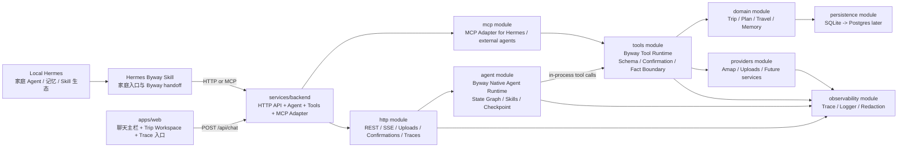
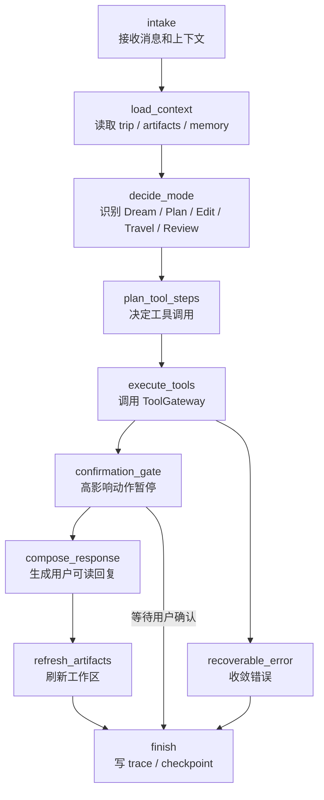

# Phase 4.0 一体化 Backend Hybrid Agent 架构设计

## 背景

前一版 Phase 4.0 采用 `services/agent-runtime` + `services/byway-mcp-server` 的物理拆分。这个方向边界清楚，但对当前阶段来说有两个成本：

- 本地开发需要同时跑更多服务，调试链路变长。
- Agent 调业务工具需要绕一层进程或网络边界，Trace 和错误定位更复杂。

现在调整为一体化 backend：

```text
Web -> Backend HTTP -> Agent Runtime Module -> Byway Tool Runtime -> Domain / DB / Providers
Hermes -> Backend MCP Adapter -> Byway Tool Runtime -> Domain / DB / Providers
```

这个调整只合并物理项目和运行进程，不合并逻辑职责。Byway 仍然保留三层核心边界：

- Agent Runtime 是智能层，负责理解、规划、状态图、checkpoint 和人机确认。
- Byway Tool Runtime 是确定性工具层，负责 schema、事实边界、确认边界、业务写入和幂等。
- MCP Adapter 是协议入口，让 Hermes 或其他外部 Agent 可以调用同一套工具。

一句话定义：

> Phase 4.0 的目标不是多服务微服务化，而是在一个 backend 里做清楚 Agent、Tools、MCP、Domain、Trace 的边界。

## 外部技术依据

设计仍参考 LangChain / LangGraph / Deep Agents 的能力方向：

- Deep Agents 面向复杂、多步骤任务，强调计划拆解、上下文管理、子 Agent 和跨线程记忆，适合旅行规划与途中调整。参考：[Deep Agents overview](https://docs.langchain.com/oss/python/deepagents/index)。
- LangGraph 的 durable execution 可用 checkpoint 支持长任务、人机确认后恢复和失败后续跑，适合 Byway 的 plan / replan / confirmation 链路。参考：[LangGraph durable execution](https://docs.langchain.com/oss/python/langgraph/durable-execution)。
- Human-in-the-loop 可以让 Agent 在高影响动作前暂停并等待用户确认，和 Byway 的 `PendingConfirmation` 模型一致。参考：[Human-in-the-loop](https://docs.langchain.com/oss/python/langchain/human-in-the-loop)。
- Deep Agents frontend patterns 支持任务进度、子 Agent 流和实时 UI，适合 Byway 的聊天主栏、Trip Workspace 和 Trace 验收。参考：[Deep Agents frontend overview](https://docs.langchain.com/oss/python/deepagents/frontend/overview)。

这些能力可以先在 TypeScript backend 内落地。后续如果需要 Python LangGraph / DeepAgents 服务，必须通过稳定 Backend Agent contract 替换内部实现，而不是让前端或 Hermes 感知迁移。

## 总目标

1. 将 `services/proxy-api`、`services/byway-mcp-server` 和规划中的 `services/agent-runtime` 收敛为 `services/backend`。
2. `/api/chat` 主链路在 backend 内部调用 Agent Runtime Module，不再使用 Proxy 规则 orchestrator。
3. Agent Runtime 通过 in-process Tool Gateway 调用 Byway Tool Runtime，避免本地开发阶段的额外服务边界。
4. Backend 同时暴露 HTTP API 和 MCP Adapter：
   - HTTP API 给 Web 使用。
   - MCP Adapter 给 Hermes 和未来外部 Agent 使用。
5. Byway Tool Runtime 继续作为唯一业务写入层，负责 Trip、Artifact、PlaceFact、RouteFact、TravelEvent、PendingConfirmation、FamilyMemory。
6. Hermes 保留为家庭 Agent 入口，通过 Hermes Byway Skill 调 Backend HTTP 或 MCP Adapter。
7. 生产可用能力内建：Trace、结构化日志、runId、threadId、checkpoint、timeout、cancel、health、评测。
8. Mock 只用于单测、E2E fixture 和离线演示，不能继续承担主产品逻辑。

## 最终架构



## Backend 内部模块

### `src/http`

HTTP 模块是 Web 产品入口。

它负责：

- 本地家庭 PIN/session 鉴权。
- `POST /api/chat` SSE。
- `GET/POST /api/trips`。
- `GET /api/trips/:tripId`。
- `GET /api/trips/:tripId/artifacts`。
- `POST /api/confirmations/:confirmationId/respond`。
- `POST /api/uploads`。
- `GET /api/traces` 和 `GET /api/traces/:traceId`。
- `GET /health`。

它不负责自然语言理解，也不直接写业务状态。业务写入必须经过 Agent 或 Tool Runtime。

### `src/agent`

Agent 模块是 Web 主链路的智能层。

它负责：

- 维护 thread / run / checkpoint。
- 构造 Agent Context Package。
- 加载 Byway Runtime Skills。
- 基于 LLM + 状态图 + 工具结果识别 Dream、Plan、Plan Edit、Place QA、Travel、Review、Memory。
- 产出可审计 tool plan。
- 通过 Tool Gateway 调用 `src/tools`。
- 对高影响动作触发 interrupt / PendingConfirmation。
- 输出稳定 `AgentEvent`，供 HTTP SSE 映射。
- 记录 mode decision、tool decision、checkpoint、interrupt、resume、error。

它不负责：

- 直接写数据库。
- 编造 PlaceFact / RouteFact。
- 绕过确认执行高影响动作。
- 在代码里维护城市词典或硬编码旅行攻略。

### `src/tools`

Tools 模块是 Byway 的确定性工具层。它替代“独立 MCP server 的内部业务位置”，但仍保留 MCP tool contract。

它负责：

- 定义 `BYWAY_TOOLS` 工具目录。
- 对每个工具做 Zod schema 校验。
- 执行 Trip、Plan、Place、Route、Travel、Review、Memory 业务工具。
- 持久化 Artifact 和业务状态。
- 强制 PendingConfirmation。
- 强制 PlaceFact / RouteFact 事实边界。
- 记录 tool span。

它提供两个入口：

```text
ToolGateway.callTool(name, input, context)
MCP Adapter -> ToolGateway.callTool(name, input, context)
```

这保证 Web Agent 和 Hermes MCP 调用的是同一套工具，不会出现两套状态或两套业务逻辑。

### `src/mcp`

MCP 模块只是协议适配层。

它负责：

- 以 MCP protocol 暴露 `BYWAY_TOOLS`。
- 将外部 MCP tool call 转成 `ToolGateway.callTool`。
- 从 MCP `_meta` 或环境变量提取 trace 信息。
- 把工具输入输出按 MCP `ToolResult` 返回。

它不负责业务逻辑，也不维护单独数据库。

### `src/domain`

Domain 模块承载稳定业务模型和纯业务服务：

- Trip。
- TripBrief。
- PlanArtifact。
- PlaceFact。
- RouteFact。
- TodayArtifact。
- ReplanOptionsArtifact。
- PendingConfirmation。
- FamilyMemory。

Domain 不知道 HTTP、MCP、SSE 或具体 Agent 实现。

### `src/providers`

Provider 模块封装外部服务：

- 高德 Place / Route。
- 本地上传存储。
- 未来真实攻略抓取、日历、天气、票务查询。

Provider 必须返回可追踪、可降级的结果。不能把 provider 错误吞掉后让 Agent 误以为事实可靠。

### `src/persistence`

Persistence 模块负责 SQLite 持久化，后续可替换 Postgres：

- trips。
- trip_briefs。
- artifacts。
- place_facts。
- route_facts。
- travel_events。
- pending_confirmations。
- family_memories。
- agent_checkpoints。
- traces 索引。

### `src/observability`

Observability 模块负责：

- traceId / requestId / turnId / runId。
- JSONL trace store。
- 结构化 logger。
- 脱敏。
- span helper。
- `/api/traces` 查询。

## Skill 设计

### Hermes Byway Skill

位置：

```text
skills/byway-family-travel-agent/SKILL.md
~/.hermes/skills/travel/byway-family-travel-agent/SKILL.md
```

定位：家庭入口 Skill。

它负责：

- 识别家庭聊天中的旅行需求。
- 携带家庭偏好、长期记忆和上下文摘要。
- 调 Backend HTTP 或 Backend MCP Adapter 创建或继续 trip。
- 把 Byway 的摘要、确认请求或 deep link 带回 Hermes 对话。

它不负责完整旅行计划编排，不直接生成真实地点事实。

### Byway Runtime Skills

位置：

```text
skills/byway-runtime/dream.md
skills/byway-runtime/plan.md
skills/byway-runtime/plan-edit.md
skills/byway-runtime/travel.md
skills/byway-runtime/review-memory.md
skills/byway-runtime/fact-and-confirmation-boundaries.md
```

定位：Backend Agent Module 的产品智能策略。

它负责：

- 定义模式判断原则。
- 定义工具 playbook。
- 定义事实边界和确认边界。
- 定义家庭旅行优先级。
- 定义 Trace 友好的行为要求。

Runtime Skills 不是规则引擎。它们提供策略和边界，具体判断由 Agent 基于 trip context、工具结果和用户自然语言完成。

## Agent 状态图

Backend Agent 使用状态图，而不是 Proxy if/else。



关键要求：

- `load_context` 必须先读权威 Trip 状态，不能只靠聊天历史。
- `decide_mode` 必须把 mode 和理由摘要写入 Trace，但不暴露完整 chain-of-thought。
- `plan_tool_steps` 输出可审计工具计划。
- `execute_tools` 只能通过 ToolGateway 执行业务动作。
- `confirmation_gate` 对 `confirm_plan`、`apply_replan`、`accept_family_memory` 等动作暂停。
- `refresh_artifacts` 用只读工具刷新前端状态。

## Web 主链路

1. 用户在 Web 输入自然语言。
2. Web 调 Backend `POST /api/chat`。
3. HTTP 模块鉴权，创建 `traceId` / `turnId` / `requestId`。
4. HTTP 模块调用 Agent Module 的 `streamTurn()`。
5. Agent 创建或恢复 `threadId`，加载 checkpoint。
6. Agent 通过 ToolGateway 调 `get_trip_state` 获取权威上下文。
7. Agent 根据 Runtime Skills、上下文和用户输入判断 mode。
8. Agent 规划并执行工具。
9. 需要确认时，Tools 创建 PendingConfirmation，Agent 中断 run。
10. HTTP 模块把 AgentEvent 映射成 SSE。
11. Web 展示聊天、Artifact 更新、确认卡、Trace 入口。
12. 用户确认后，Web 调 `POST /api/confirmations/:id/respond`，Backend 恢复 run 或执行后续 tool。

## Hermes 家庭入口链路

1. 用户在 Hermes 家庭对话中说旅行需求。
2. Hermes 加载 `byway-family-travel-agent` Skill。
3. Skill 判断这是 Byway 任务，并收集必要家庭上下文。
4. Hermes 调 Backend HTTP 或 MCP Adapter：
   - 创建 trip。
   - 追加一轮 chat。
   - 查询 trip 状态。
   - 获取确认请求。
5. Backend Agent 完成旅行 Agent 工作。
6. Hermes 返回简短摘要和 Byway deep link。

这条链路保留 Hermes 的家庭记忆和日常入口，同时让 Byway 的复杂旅行能力由专用 backend Agent 承担。

## 内部契约

### AgentEvent

```ts
type AgentEvent =
  | { type: "run_started"; runId: string; threadId: string; traceId: string }
  | { type: "mode_decided"; mode: string; reasonSummary: string }
  | { type: "subtask_started"; name: string; label: string }
  | { type: "tool_call_started"; toolName: string; callId: string; inputSummary?: unknown }
  | { type: "tool_call_completed"; toolName: string; callId: string; outputSummary?: unknown }
  | { type: "artifact_updated"; artifactType: string; artifactId: string; version: number }
  | { type: "confirmation_required"; confirmationId: string; summary: string }
  | { type: "assistant_message_delta"; text: string }
  | { type: "run_completed"; runId: string }
  | { type: "run_failed"; code: string; message: string; recoverable: boolean };
```

### ToolGateway

```ts
type ToolCallContext = {
  traceId: string;
  turnId?: string;
  runId?: string;
  userId: string;
  tripId?: string;
  source: "agent" | "mcp" | "test";
};

type ToolGateway = {
  callTool(name: string, input: unknown, context: ToolCallContext): Promise<ToolResult<unknown>>;
  listTools(): ToolCatalogItem[];
};
```

Agent 和 MCP Adapter 都只能通过这个接口执行 Byway 业务工具。

## Trace 和可观测性

每一轮 chat 必须生成 trace。

必须记录：

- `chat.request.received`
- `agent.run.started`
- `agent.context.loaded`
- `agent.skill.loaded`
- `agent.mode.decided`
- `agent.tool.plan.created`
- `tool.started`
- `tool.completed`
- `tool.failed`
- `mcp.request.received`
- `mcp.response.sent`
- `provider.request.started`
- `provider.request.completed`
- `provider.request.failed`
- `agent.confirmation.interrupted`
- `agent.run.resumed`
- `artifact.refreshed`
- `sse.event.sent`
- `chat.request.completed`
- `chat.request.failed`

Trace 存储：

- 本地默认：`.byway/traces/YYYY-MM-DD/<traceId>.jsonl`
- API：`GET /api/traces`、`GET /api/traces/:traceId`
- 可选外部：LangSmith 或 OpenTelemetry exporter

Trace 必须脱敏：

- API key。
- Authorization / cookie / session token。
- 家庭 PIN。
- 手机号中间位。
- 上传正文长文本。
- 用户隐私字段。

## Checkpoint 和恢复

Backend 必须持久化 Agent checkpoint：

- threadId 和 tripId 映射。
- runId。
- 当前 mode。
- 已完成工具调用摘要。
- 等待确认的 interrupt。
- 最近一次 assistant response。
- 错误和 retry 状态。

第一阶段使用 SQLite 表。后续迁移 Postgres 时，不改变 Agent、ToolGateway 和 MCP Adapter 的接口。

## Mock 的位置

Mock 保留，但降级为工程工具：

- 单元测试。
- E2E fixture。
- 离线 demo。
- Backend Agent 不可用时的显式开发 fallback。

生产配置中：

```text
BYWAY_AGENT_MODE=native
```

不得静默使用 mock。

## 关键验收场景

1. 用户从 Dream Mode 选择杭州，后续说“第三天可以改成灵隐寺吗”，系统不会生成青岛内容。
2. 用户说“第三天下午加一点室内活动，别太累”，Agent 读取当前计划，解析新增地点或活动类型，更新 PlanArtifact，并说明假设。
3. 用户说“老人累了，我们晚了 40 分钟”，Agent 记录 TravelEvent，生成多个 ReplanOptions，未确认前不应用。
4. 用户确认重排方案后，Agent 消费 PendingConfirmation 并更新 TodayArtifact / PlanArtifact。
5. Hermes 家庭入口中提出旅行需求时，Hermes Skill 能把任务转交 Backend HTTP 或 MCP Adapter，并返回 Byway trip 摘要或链接。
6. 每个验收场景都能通过 trace 看出：上下文、mode、工具计划、ToolGateway 输入输出、Provider 输入输出、确认中断、Artifact refresh。

## 主要假设

1. 当前阶段优先采用一体化 `services/backend`，而不是拆成多个独立 Node 服务。
2. 一体化只合并物理项目和进程，不合并 Agent、Tools、MCP、Domain 的逻辑边界。
3. Hermes 作为家庭入口和记忆生态保留，通过 Backend HTTP / MCP 与 Byway 协同。
4. Backend Agent 第一版保持 TypeScript 单仓优先；如果 LangGraph JS / DeepAgents JS 能力不足，再在 Agent 模块内部替换实现。
5. ToolGateway 仍是唯一业务写入入口。
6. 生产验收必须依赖 Trace，而不是只看聊天界面。
7. UI 美化不属于 Phase 4.0，Phase 4.0 只保证交互结构、事件、可观测性和 Agent 能力。

## 与旧 Phase 4.0 的关系

旧文档 `docs/superpowers/archive/2026-05-25-superseded-architecture/specs/2026-05-24-phase-4-agent-runtime-orchestration-design.md` 是 Hermes-first 版本，已归档为决策历史。

本文是当前执行依据。对应实施计划是 `docs/superpowers/plans/2026-05-24-phase-4-hybrid-agent-runtime.md`。
